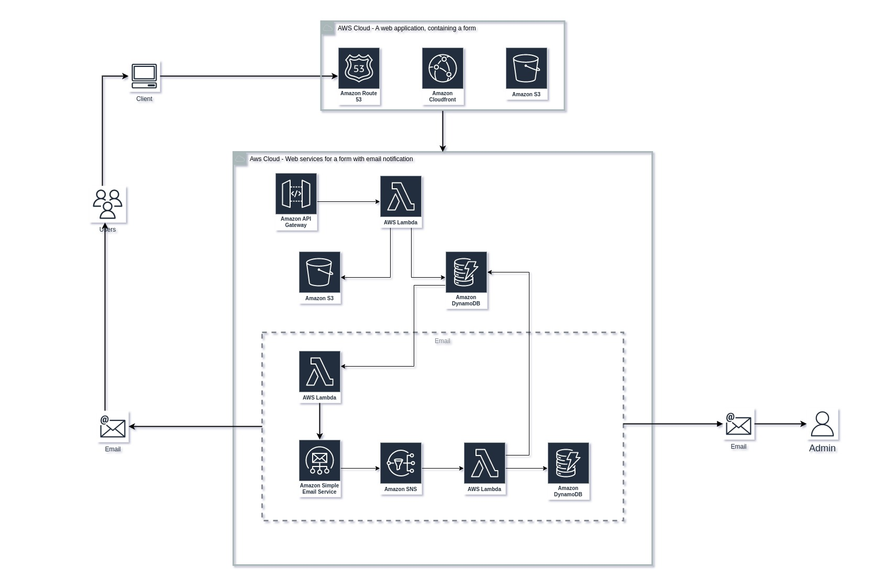

## AWS Serverless web application

#### A high level overview of the services.

#### Resources
- [Building a Serverless application](https://aws.amazon.com/getting-started/hands-on/build-serverless-web-app-lambda-apigateway-s3-dynamodb-cognito/)
- [Building a serverless contact form with AWS Lambda and AWS SES](https://awstip.com/building-a-serverless-contact-form-with-aws-lambda-and-aws-ses-6c07de5323)
- [Send Emails Serverlessly With Node.js, Lambda, and AWS SES](https://betterprogramming.pub/send-emails-serverlessly-with-node-js-lambda-and-aws-ses-186cba40d695)
- [Serverless patterns](https://serverlessland.com/patterns)

#### Requirements
- Install AWS cli. 
- [How to install AWS cli on Ubuntu 20.x.](https://gist.github.com/alecsandrapetruescu/78a17b5c2e530787fea25814f6ccbc53)
